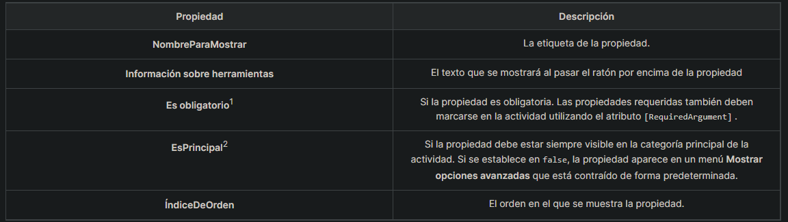

# UiPath Custom Activities
A manual for creating uipath custom activities

## Requisitos previos
- Visual Studio Community/Professional/Enterprise 2022
- La fuente oficial de UiPath https://pkgs.dev.azure.com/uipath/Public.Feeds/_packaging/UiPath-Official/nuget/v3/index.json debe añadirse como origen del paquete desde Herramientas > Opciones > Gestor de paquetes NuGet > Orígenes del paquete
- Microsoft .NET SDK 6
- Plantilla de actividades de UiPath
- UiPath Studio

1- Añadir la fuente oficial de uipath al gestor de paquetes NuGet
https://pkgs.dev.azure.com/uipath/Public.Feeds/_packaging/UiPath-Official/nuget/v3/index.json en Herramientas > Opciones > Gestor de paquetes NuGet > Orígenes del paquete

Antes

Despues 

2. Descargar el template del proyecto de una actividad custom para uipath de este link https://github.com/UiPath/Community.Activities/tree/develop/Activities/Templates/UiPath.Activities.Template/VisualStudio

3. Ve a Herramientas > Opciones > Proyectos y soluciones > Ubicaciones y comprueba la ruta establecida para la ubicación de la plantilla del proyecto de usuario.
Extraer el path y ahi pegar el tempate previamente descargado en el paso 2

4. Al reiniciar visual studio, la plantilla para crear una actividad custom compatible con uipath, aparecera en el menu de opciones 

## Estructura del proyecto
La plantilla de actividades de UiPath para Visual Studio sirve como punto de partida para crear actividades personalizadas. Base sus actividades en esta plantilla y modifíquela para adaptarla a sus necesidades. La plantilla genera un andamio de actividad llamado ActivityTemplate que contiene todos los componentes necesarios de una actividad completamente funcional en UiPath Studio.
Una solución de actividad basada en esta plantilla contiene tres proyectos:

### UiPath.Activities.Template
Este proyecto contiene la lógica, el diseño y los metadatos de la actividad. 
El proyecto contiene lo siguiente:

#### ActivityTemplate.cs
El archivo de código para la lógica de la actividad. Añade el código al cuerpo de la función public void ExecuteInternal() .
#### ViewModels
Una carpeta que contiene los archivos que definen el diseño de la actividad. ViewModel es un concepto utilizado por las actividades de UiPath para describir cómo deben mostrarse en Studio (qué propiedades mostrar, qué entrada aceptar, etc.). Colocar todos los archivos de ViewModel en esta carpeta te ayuda a realizar un seguimiento de ellos más fácilmente.

> Con ViewModel, la IU de las actividades se genera de forma descriptiva. El elemento de la IU que se muestra en Studio se determina en función del tipo de entrada seleccionado de una propiedad. Por ejemplo, para las propiedades con el tipo de entrada bool se muestra un alternador de Activado/Desactivado, mientras que para las propiedades enum se muestra un menú desplegable.

#### Carpeta de recursos
Recursos utilizados por la actividad, como el icono, los metadatos de la actividad y un archivo RESX que almacena las cadenas localizadas utilizadas por la actividad (nombre de la actividad, descripción, etiquetas de propiedad e información sobre herramientas, etc.).

### UiPath.Activities.Template.Packaging 
Este proyecto crea el paquete NuGet para la actividad cada vez que se crea la solución. Para obtener más información, consulta Compilación de la solución y creación del paquete NuGet.

### UiPath.Activities.Template.Tests 
Este es un proyecto de prueba que contiene pruebas unitarias y de flujo de trabajo. Para obtener más información, consulta Probar tu actividad.

## Desarrollo
La clase llamada ActivityTemplate.cs donde se  encuentra la lógica de la actividad, sera renombrado en base a nuestras necesidades, para el ejemplo mostrado en la documentacion, usaremos el ejercicio de una calculadora. 
Por lo que esa clase sera renombrada como Calculator.cs

## Diseño de la actividad
Las entradas disponibles en una actividad están determinadas por los tipos de datos de las propiedades. En la actividad Calculadora de ejemplo, el tipo de datos int de las propiedades FirstNumber y SecondNumber da como resultado un editor de números como campo de entrada para las propiedades, mientras que para Operation, que tiene el tipo de datos enum , un menú desplegable estará disponible en la actividad.

> Las etiquetas y la información sobre herramientas de las propiedades se pueden definir en el archivo Resources.resx.

### Crear el dise;o de la actividad
Para crear el dise;o de una actividad lo primero que tenemos que hacer es renombrar nuestra clase ActivityTemplateViewModel.cs por el nombre de nuestra clase que contiene la logica de la actividad dejando el sufijo ViewModel.cs
Para el ejemplo de la calucladora seria CalculatorViewModel.cs

en este archivo se definen los argumentos, su tipo, ya sean de entrada o de salida.
>El nombre de los argumentos deben ser iguales a los nombres de las variables en la clase donde se encuentra la logica de la actividad.

Tambien se modifican las propiedades a cada uno de los argumentos, propiedades como su nombre, su tooltip, si es obligatorio o no y el orden en el que se mostrara en la actividad.
Esto se hace en la clase InitializedModel().
Que usa como apoyo el archivo Resources.resx, almacenado en la carpeta de resources. en este archivo se escriben todos los valores  de las propiedades de la actividad.
como lo son el nombre, los tooltips. Esto como uso de las buenas practicas.

